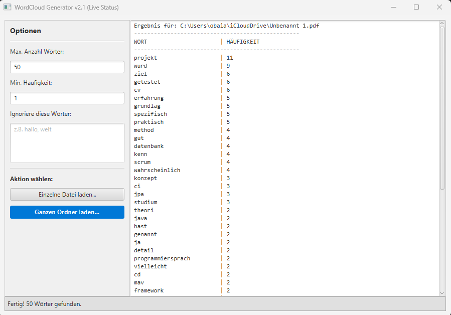
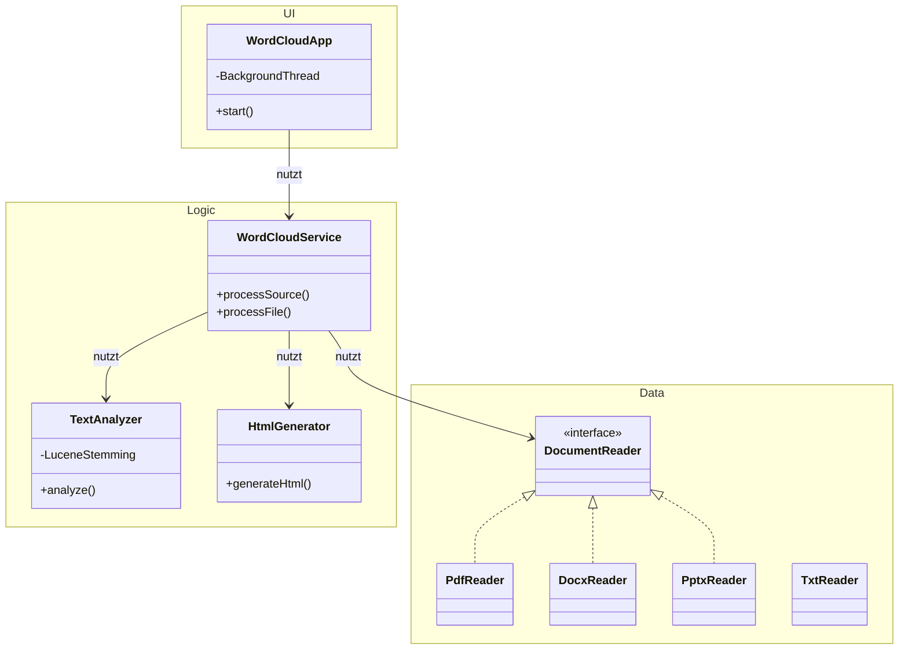

# ☁️ Java WordCloud Generator


Ein leistungsstarkes Desktop-Tool zur Analyse von Dokumenten und zur Generierung von Wordclouds. Die Anwendung unterstützt **PDF, Word (DOCX), PowerPoint (PPTX) und Textdateien** und bietet fortschrittliche Textanalyse (Stemming, Stopwords) dank **Apache Lucene**.

---

## 📸 Screenshots

### Benutzeroberfläche & Optionen
<p align="center">
  
</p>

---

## 🚀 Features

* **📂 Multi-Format Support:** Liest `.txt`, `.pdf` (Apache PDFBox), `.docx` (Apache POI) und `.pptx` (Apache POI).
* **📁 Batch-Processing:** Analysiert einzelne Dateien oder **ganze Ordnerstrukturen** rekursiv.
* **🧠 Intelligente Analyse:**
    * **Stemming:** Führt Wörter auf ihren Wortstamm zurück (z.B. "laufen", "lief" -> "lauf") mittels *GermanAnalyzer*.
    * **Stopwords:** Filtert automatisch unwichtige Füllwörter raus.
    * **Custom Filter:** Benutzer können eigene Wörter definieren, die ignoriert werden sollen.
* **📊 Live-Status:** Zeigt den Fortschritt der Analyse in Echtzeit an (Multithreading).
* **🌐 HTML Export:** Generiert eine interaktive, klickbare Wordcloud im Browser.

---

## 🏗 Architektur

Das Projekt folgt einer **Layered Architecture** (Schichtenarchitektur):



---

## 🛠 Technologien

* **Java JDK 17**
* **JavaFX:** Für das moderne User Interface.
* **Apache Maven:** Dependency Management & Build.
* **Bibliotheken:**
* `org.apache.pdfbox` (PDF lesen)
* `org.apache.poi` (Microsoft Office Dokumente lesen)
* `org.apache.lucene` (Linguistische Textanalyse)


* **JUnit 5:** Unit- und Integrationstests.

---

## ⚙️ Installation & Build

### 1. Klonen

```bash
git clone [https://github.com/ObaiAlbek/Java-WordCloud-Generator.git](https://github.com/ObaiAlbek/Java-WordCloud-Generator.git)

```

### 2. Bauen (Maven)

Erstellt eine "Fat-Jar" mit allen Abhängigkeiten.

```bash
mvn clean install

```

### 3. Starten

Die Anwendung kann über die generierte JAR oder direkt aus der IDE gestartet werden.

```bash
java -jar target/WordCloudGenerator-1.0-SNAPSHOT.jar

```

---

## 📝 Lizenz

Erstellt als Semesterprojekt an der Hochschule Mannheim.

```
